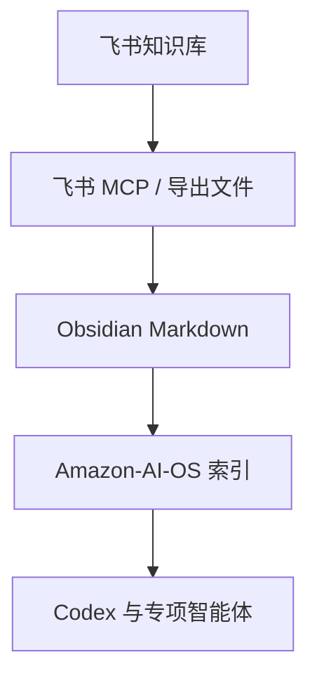

# 飞书知识库关联配置

## 当前状态

| 项目 | 状态 |
|---|---|
| 飞书 MCP 本地包 | 已下载 |
| 飞书 MCP 启动脚本 | 已存在：`.codex/mcp/start-feishu-lark-mcp.ps1` |
| `FEISHU_APP_ID` | 已配置 |
| `FEISHU_APP_SECRET` | 已配置 |
| `LARK_DOMAIN` | 已配置 |
| `LARK_TOOLS` | 已配置 |
| `LARK_TOKEN_MODE` | 已配置 |
| 知识库读取 | 待用户访问令牌或知识空间授权 |

## 关联原则

飞书知识库是上游源，Obsidian 是 Amazon-AI-OS 的长期知识层。飞书内容进入智能体体系前，应先同步为 Markdown，并写入 [[飞书同步日志]]。

## 同步流向

## 下一步启用条件

- 给飞书应用授权目标知识空间，或启用用户访问令牌。
- 确认同步范围：整个知识空间、指定目录，或指定文档。
- 同步后检查附件、表格、双链和未处理项。

## 授权入口

- [[飞书知识库授权操作说明]]
- 本地双击入口：.codex/mcp/运行飞书用户授权.cmd

