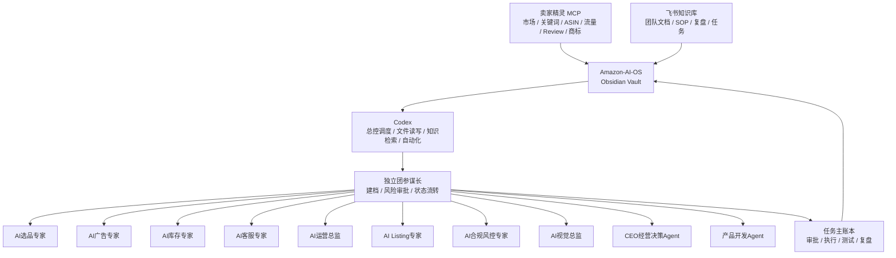

# Amazon-AI-OS 架构总控

## 架构链路

## 分层职责

| 层级 | 组件 | 职责 | 状态 |
|---|---|---|---|
| 外部数据层 | 卖家精灵 MCP | 类目、关键词、ASIN、竞品、流量、Review、商标、趋势数据 | 当前 Codex 会话可发现 |
| 上游知识层 | 飞书知识库 | 团队共创、文档源、SOP、会议复盘 | 已有 MCP 启动配置，待读取授权 |
| 知识操作系统 | Amazon-AI-OS / Obsidian | Markdown 知识库、双链、附件、隔离区、同步日志 | 已建立 |
| 执行调度层 | Codex | 读取 Vault、维护配置、调度 MCP、生成/更新文件 | 已关联 |
| 岗位智能体层 | 专项智能体 | CEO决策、选品、广告、库存、客服、Listing、Review、产品开发、合规等岗位输出 | 已建路由 |
| 员工权限层 | 公司规则 | 老板、运营主管、运营助理、广告专员、客服、采购/供应链权限矩阵 | 已建规范与机器配置 |
| GitHub协同层 | 私有仓库 | 多电脑同步、版本追溯、目录隔离和成员权限 | 本地规则已准备，待创建远端仓库 |

## 视觉岗位协作

- `AI视觉总监` 负责主图、辅图、A+、场景图、信息图、视频脚本、竞品视觉扫描和设计师交付清单。
- 与 `AI Listing专家` 协作提炼卖点、图片文案和 A+ 模块结构。
- 与 `AI合规风控专家` 协作检查主图白底、商品占比、商标、认证、功效声明和平台图片规范风险。
- 与 `评价与VOC` 协作提炼用户痛点、购买理由、差评风险和图片需要解释的产品细节。
- 与 `AI运营总监` 协作确定视觉改版优先级、测试节奏和转化复盘指标。
## 默认闭环

`接收指令 -> 安全检查 -> 任务分析 -> 首轮取证 -> 智能体分派 -> 综合建议 -> 风险审批 -> 二次验证 -> 执行方案 -> 测试验收 -> 结果监控 -> 复盘回写`

详细规则见 [[独立团协作运行规范]]。正式任务使用 [[../08_项目管理/任务主账本/任务记录模板|任务记录模板]] 建档。

## 审批原则

- 低风险内部分析可自动进入执行方案。
- Listing、广告和运营调整建议在执行前由负责人审批。
- 预算、补货、付款、账号、申诉、合规与侵权事项必须由负责人及专业角色审批。
- 不自动执行真实预算、付款、补货下单、后台发布、申诉提交和账号操作。

## 核心 Agent

第一版固定 8 个核心 Agent：

1. CEO经营决策Agent
2. 亚马逊选品专家Agent
3. 广告优化Agent
4. 库存补货Agent
5. Listing优化Agent
6. Review分析Agent
7. 客服合规回复Agent
8. 产品开发Agent

## 安全边界

- `99_隔离_黑帽资料/` 不进入日常检索和智能体输出。
- 黑帽、灰黑、平台规避类资料只可用于合规审计、删除处置、风险识别和安全拒绝。
- 卖家精灵 MCP 没返回的数据必须标注缺失，不得凭经验补齐。
- 店铺内部数据优先级高于外部估算。
- 二次验证不可用时，中高风险任务保持“受阻”，不得进入真实执行。
